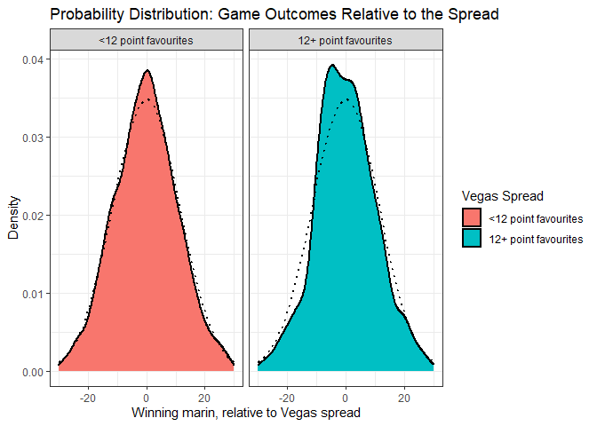
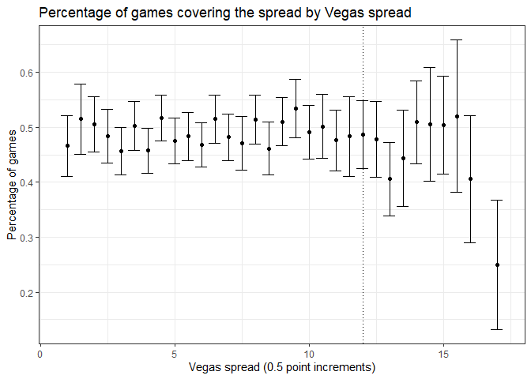
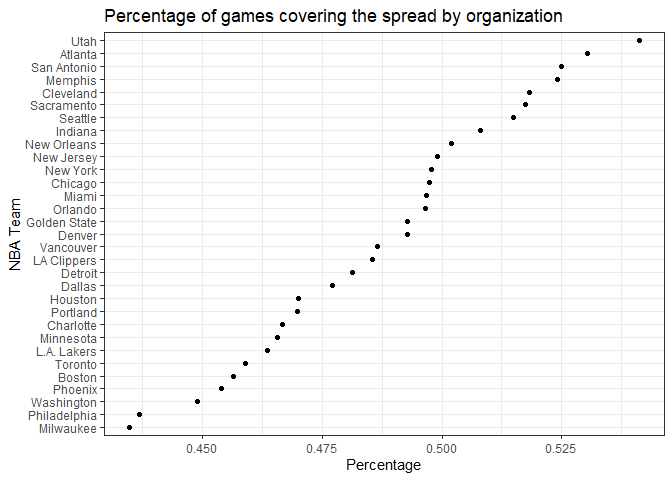
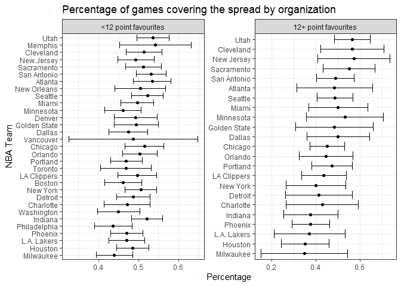
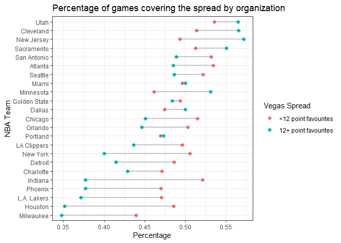

Replicating Point Shaving: Corruption in NCAA Basketball
================
Jordan Hutchings
22/04/2021

# Replicating Point Shaving: Corruption in NCAA Basketball with NBA data

The purpose of this document is to replicate the study, [Point Shaving:
Corruption in NCAA
Basketball](https://users.nber.org/~jwolfers/papers/PointShaving.pdf)

The article author Professor Justin Wolfers, provides betting line data
for the 1991 - 2004 NBA season, similar to the NCAA Div 1 data set used
in the paper being replicated. The NBA dataset contains 15,507 games
while the NCAA dataset contains 44,120 games from 1989 - 2005.

``` r
# set directory and load packages and read in data
setwd("C:/Users/user/Desktop/ML&DS/projects/sports_analyics")

library(haven)
library(dplyr)
library(ggplot2)
df <- read_dta('betting_odds.dta')
```

## clean the data

The dataset, while very clean, requires us to construct the spread
between the difference in scores and the game spread.

We are interested in the spread line `odds1`, the result of the spread
`result1`, and whether the home or away team is favourited. We can
deduce the better team from the sign of `odds1`, where a positive number
indicates the home team is favourited, and a negative number favours the
away team.

We will construct a variable for the winning margin less the spread, and
a dummy variable for games with a 12 point spread or greater.

``` r
# how do we interpret odds1?
df <- mutate(df, score_diff = home_score - away_score) 
lm(score_diff ~ odds1, data = df) #positibe beta => higher odds1, more favourited team 1 is.
```

    ## 
    ## Call:
    ## lm(formula = score_diff ~ odds1, data = df)
    ## 
    ## Coefficients:
    ## (Intercept)        odds1  
    ##     0.03123      0.96184

``` r
# grab favourites, check if favourites won, and by how much relative to line
df <- mutate(df, 
             fav = ifelse(odds1 > 0, "H", "A"),
             fav_win = ifelse(fav == result1, 1, 0),
             spread_margin = home_score - odds1 - away_score, 
             fav_cover = ifelse((fav == "H" & spread_margin > 0), 1, 
                                ifelse((fav == "A" & spread_margin < 0), 1, 0)), 
             twelve = ifelse(abs(odds1) > 11, "12+ point favourites", "<12 point favourites"))

df <- filter(df, !is.na(odds1))

sd = sd(df$spread_margin)

ggplot(df, aes(spread_margin, color = twelve)) + geom_density(size = 1) +
  stat_function(fun = function(x) dnorm(x, mean = 0, sd = sd),
                color = "black", linetype = "dotted", size = 1) + 
  xlim(c(-30,30)) + 
  facet_wrap(.~twelve) + 
  labs(title = "Probability Distribution: Game Outcomes Relative to the Spread", 
       y = "Density", x = "Winning marin, relative to Vegas spread") + 
  theme_bw()
```

<!-- -->

We can see there is a significant dip in the number of teams who did not
cover the spread for games with a 12 point or greater spread.

The next piece to examine is why choose a spread of 12 points. Why not
11 or 13 points? To do this, lets look at the probability of a team
covering the spread relative to the size of the spread for teams who do
and do not cover. This will resemble Figure 3 of the paper.

``` r
df %>%
  filter(odds1 > 0) %>%
  group_by(odds1) %>%
  summarise(n = n(), 
            cover_percent = sum(fav_cover)/n, 
            se = sqrt(cover_percent*(1-cover_percent) / n)) %>%
  filter(n > 30) %>%
  ungroup() %>%
  ggplot(aes(x=odds1, y=cover_percent)) + 
      geom_point() + 
      geom_errorbar(aes(ymin = cover_percent - 1.96 * se, 
                        ymax = cover_percent + 1.96 * se)) +
  geom_vline(xintercept = 12, linetype = 'dotted') + 
      labs(title = 'Percentage of games covering the spread by Vegas spread', 
           x = 'Vegas spread (0.5 point increments)', 
           y= 'Percentage of games') + 
      theme_bw()
```

<!-- -->

What does each team’s probability of covering the spread look like?

``` r
# what is the cover rate for winning teams conditional on the spread?
df %>%
  mutate(favourite = ifelse(fav == "H", home_team, away_team)) %>%
  group_by(favourite) %>%
  summarise(cover_percent = mean(fav_cover),
            n = n(),
            se = sqrt(cover_percent*(1-cover_percent)/n)) %>%
  filter(n > 20) %>%
  ggplot(aes(x=favourite, y=cover_percent)) + 
  geom_point(aes(reorder(favourite, cover_percent, mean), y=cover_percent)) + 
  #geom_errorbar(aes(ymin = cover_percent - se * 1.96, ymax = cover_percent + se * 1.96)) + 
  coord_flip() + 
  labs(title = 'Percentage of games covering the spread by organization', 
           x = 'NBA Team', 
           y= 'Percentage') + 
  theme_bw()
```

<!-- -->

``` r
df %>%
  mutate(favourite = ifelse(fav == "H", home_team, away_team)) %>%
  group_by(favourite, twelve) %>%
  summarise(cover_percent = mean(fav_cover),
            n = n(),
            se = sqrt(cover_percent*(1-cover_percent)/n)) %>%
  filter(n > 20) %>%
  ggplot(aes(x=favourite, y=cover_percent)) + 
  geom_point(aes(reorder(favourite, cover_percent, mean), y=cover_percent)) + 
  geom_errorbar(aes(ymin = cover_percent - se * 1.96, ymax = cover_percent + se * 1.96)) + 
  coord_flip() + 
  labs(title = 'Percentage of games covering the spread by organization', 
           x = 'NBA Team', 
           y= 'Percentage') + 
  theme_bw() +
  facet_wrap(.~twelve, scales = 'free')
```

<!-- -->

``` r
df %>%
  mutate(favourite = ifelse(fav == "H", home_team, away_team)) %>%
  group_by(favourite, twelve) %>%
  summarise(cover_percent = mean(fav_cover),
            n = n(),
            se = sqrt(cover_percent*(1-cover_percent)/n)) %>%
  filter(n > 20) %>%
  ungroup() %>%
  group_by(favourite) %>%
  mutate(n_team = n()) %>%
  filter(n_team > 1) %>%
  ggplot(aes(x=favourite, y=cover_percent)) + 
  geom_line(alpha = 0.5, size = 1) + 
  geom_point(aes(reorder(favourite, cover_percent, mean), y=cover_percent, color = twelve), size = 2) + 
  coord_flip() + 
  labs(title = 'Percentage of games covering the spread by organization', 
           x = 'NBA Team', 
           y= 'Percentage') + 
  theme_bw()  
```

<!-- -->
